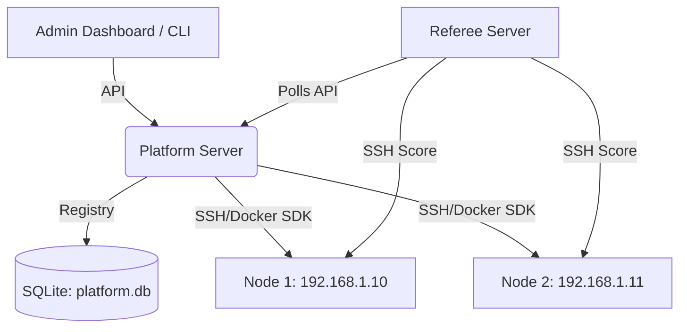

# KoTH Orchestrator v2


A premium, distributed King-of-the-Hill (KoTH) competition platform for running replicated vulnerable instances with a generalized, remote-orchestration control plane.

## v2 Architecture Redesign

The platform has been completely rebuilt from the ground up to eliminate hardcoded dependencies. Instead of static `docker-compose.yml` series and HAProxy routing, **v2 introduces a dynamic Machine Registry and Node Mapping system.**

You can now upload **any** machine specification (`.zip` containing a `koth-machine.yaml` and Dockerfile), register physical Node IPs, and orchestrate deployments instantly via the Web Dashboard or the sleek Terminal UI.



## Features

- **Dynamic Registry**: Upload packaged machines via ZIP directly through the UI. No more manual `docker-compose` edits.
- **Node Mappings**: Register remote servers (Nodes) by their IP, allowing you to seamlessly target deployments.
- **Dual-Interface Management**: Manage your event through the **Premium Web Dashboard** or the **`rich`-powered Terminal UI**.
- **Automated Setup Wizard**: First-time launch guides you through creating an Admin account, registering your first Node, and importing example challenge packs.
- **Decoupled Scoring Engine**: The `referee` server operates independently, dynamically fetching active targets from the `platform` API.

## Repository Layout

```text
.
|-- platform/           # Core FastAPI orchestration server and Web UI
|-- referee/            # Independent scoring engine
|-- cli/                # Terminal UI (koth.py)
|-- examples/           # Pre-built vulnerable machines (Series H1-H8)
|-- docs/               # Architecture and operations documentation
|-- docker-compose.yml  # Legacy local/dev helper
```

## Quick Start

### 1. Launch the Platform
Navigate to the platform directory and start the orchestrator:

```bash
cd platform
pip install -r requirements.txt
python -m uvicorn app:app --host 0.0.0.0 --port 8000
```

### 2. Complete the Setup Wizard
Open your browser to `http://localhost:8000/`. The platform will automatically redirect you to the **Initial Setup Wizard** to configure your master Admin account and initial infrastructure.

### 3. Use the Terminal UI (Optional)
If you prefer managing the competition from the command line:

```bash
cd cli
pip install -r requirements.txt
python koth.py status
```

## Documentation
- [Contributing Guidelines](CONTRIBUTING.md)
- *Note: the `docs/` folder contains historical v1 documentation that is currently being updated for the v2 release.*

## Safety

Run this project only in infrastructure you own or are explicitly authorized to use. The challenge services are intentionally vulnerable.
